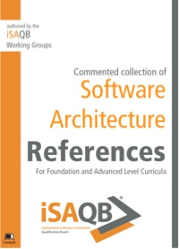

# iSAQB Software Architecture References

This repository contains the annotated [iSAQB](https://isaqb.org) references,
both for CPSA-Foundation level and CPSA-Advanced curriculae.

This repository contains the sources for the published version of
the iSAQB references, available both online and in various eBook formats
at [Leanpub (https://leanpub.com/isaqbreferences)](https://leanpub.com/isaqbreferences).

In addition, a public version of the document will also be available at iSAQB.org in the download/document section.

This e-book has been initiated by Dr. Gernot Starke and is maintained by volunteers
of iSAQB (see the list of [contributors](https://github.com/isaqb-org/references/graphs/contributors)).

This document is and will always be free of charge.

## Donating to EEF (Electronic Frontier Foundation)

All royalties from Leanpub sales (which are optional for readers!)
of this book are donated to
the [Electronic Frontier Foundation (eff.org)](http://eff.org).

## License

This book is licensed under a
[Creative Commons Attribution 4.0 International License](https://creativecommons.org/licenses/by/4.0/).

The following is only a brief summary and no substitution for the real
[licence](https://creativecommons.org/licenses/by/4.0/).

The cc-4.0-by license means that you might:

* Share — copy and redistribute the material in any medium or format
* Adapt — remix, transform, and build upon the material for any purpose, even commercially.
* The licensor cannot revoke these freedoms as long as you follow the license terms.

You must:

* Give **appropriate credit**,
* Provide a link to the license (https://creativecommons.org/licenses/by/4.0/), and
* Indicate if changes were made.
